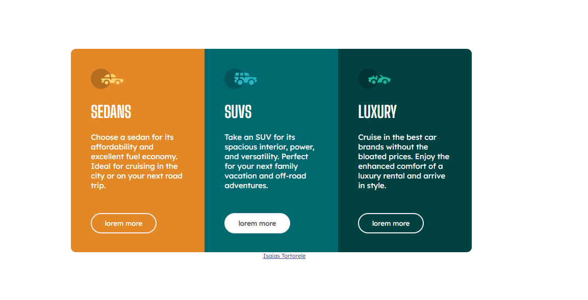
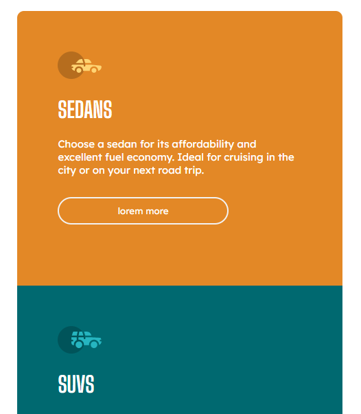

# Desafio-Frontend-Mentor#
Desafio era construir um cartão de visualização de 3 colunas e fazê-lo parecer o mais próximo possível do design proposto.

<a href="https://github.com/Isaias-Tortorele/Desafio-Frontend-Mentor">Site</a>

* **Design desktop** *

* **Design mobile** *

